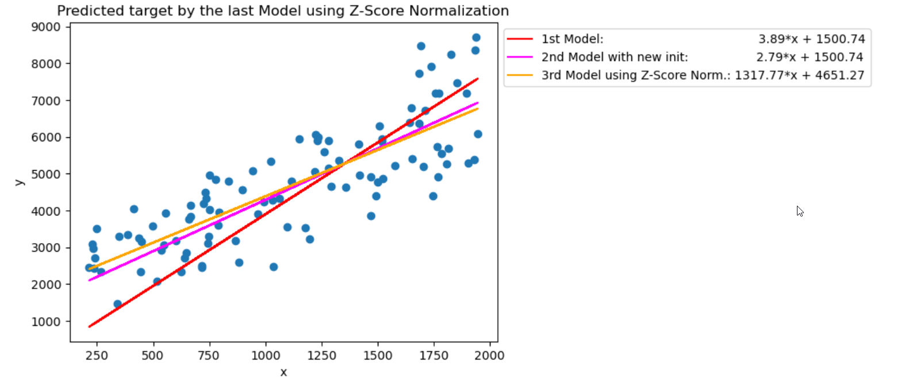
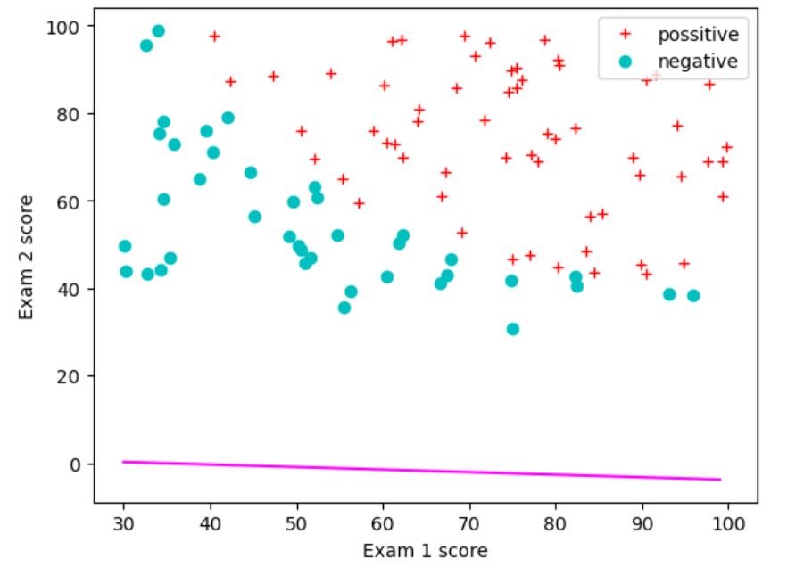
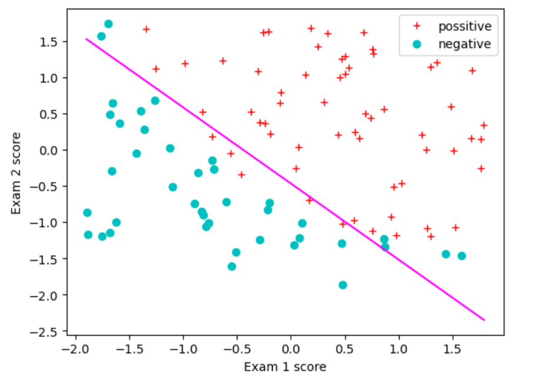
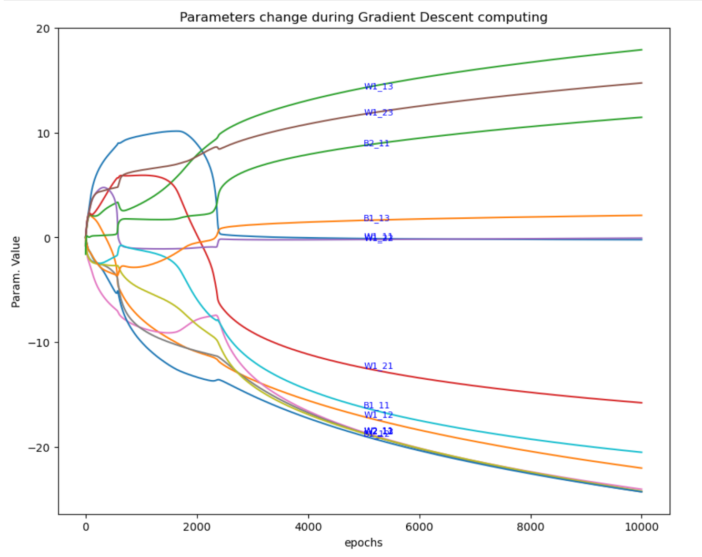

# ML_fromScratch 
A collection of foundational Machine Learning algorithms built from scratch to demystify the core concepts behind them.
  
  
  
## Context

This series of notebooks and libraries aims to build foundational Machine Learning models from scratch using only **NumPy** (without any **ML frameworks**). The goal is to strengthen understanding by implementing these models step by step.

The project is structured into four parts, guided by my mentor **Artem Yankov** and inspired by the Machine Learning Specializations by **Andrew Ng**.

For Part 3 (Neural Networks), we explicitly include the mathematical derivations behind forward and backpropagation, providing a deeper understanding of how these models learn.

## Summary

- [part 1](./ML_firstSteps_P1.ipynb): Linear Regression (Simple LR, Multiple LR and Polynomial LR)
- [part 2](./ML_firstSteps_P2.ipynb): Logistic Regression
- [part 3](./ML_firstSteps_P3.ipynb): Neural Networks (for Regression and Classification tasks)
- [part 4](./ML_firstSteps_P4.ipynb): Neural Networks applied to **MNIST dataset** (3 layers NN using a custom-built library)

## Highlights

### A. The relevance of Scaling

Beyond implementing algorithms from scratch, we uncovered key insights during the process. One is the crucial role of feature scaling in optimization and convergence. The other highlights how neural networks evolve during training, shedding some light on parameter updates and learning dynamics.

#### Linear Regression:

Feature scaling significantly accelerates convergence. The cost function `J(w,b)` reaches a lower value more efficiently, even when starting from zero-initialized weights.

#### Logistic Regression

 

Observe the difference of using Logistic Regression without(left) and with(right) scaling. Scaling ensures better convergence and prevents numerical instability.

### B. Tracking Neural Network Weight changes during Gradient Descent

This visualization demonstrates how NN parameters (weights) evolve over sucessive gradient descent steps.

After the storm comes the calm...🌤️